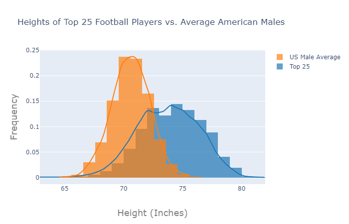
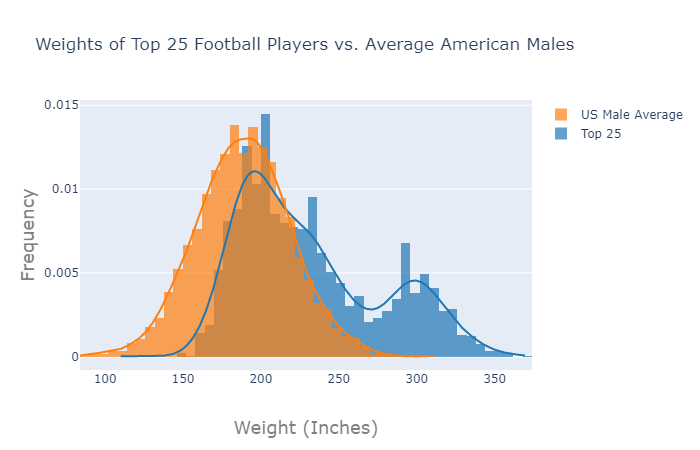

# The Height and Weight Distributions of AP Top 25 Football Teams
I attend Clemson University, and when I am walking to class every day, it is very easy to distiguish who the football players are. Although they dress like typical students and go to the same classes, they seem substantially physically larger, both in height and in weight. To investigate this disparity further, I wrote a python script (scrape.py) to read ESPN.com and determine who the current top 25 teams are, then scrape the heights and weights listed on their rosters. Because ESPN already had all the rosters compiled in a standard format on their website, it was very easy to compile a list of all 3020 players on the rosters of these top 25 teams. \
\
After forming these lists, I plotted the data using plot.ly to histograms, one for height and one for weight. However, after seeing the results, I realized that I was missing a crucial piece of information. While the resulting graphs seemed to be accurate, there was not much to be gained from reading them, as there was nothing to compare them to. \
\
To give the reader a better frame of reference, I used data from the [National Health Statistics Reports](https://www.cdc.gov/nchs/data/nhsr/nhsr122-508.pdf), published by the CDC. This contains the mean and the standard deviation of both height and weight of 20-39 year old American Males. I then used the numpy.generate.normal module to generate 3020 heights and weights to simulate what the dataset might look like if the subjects were randomly generated. \
\
Now that there was comparative data, the graphs were much more readable.

\
As you can see, with regards to height, football players on the top teams in the NCAA are notably taller than the average American male, as the centers of the two distributions differ by roughly 5 inches. Weight is a bit more interesting though, with more of a bimodal distribution. The bottom half of the distribution, which can be assumed to be the skill players, is more or less in line with the general population distribution. Meanwhile, the top half of the football distribution (the linemen), clearly stands apart from the general population, which makes sense, as it is a poition that typically weights size more heavily in recruitment than other poitions.
